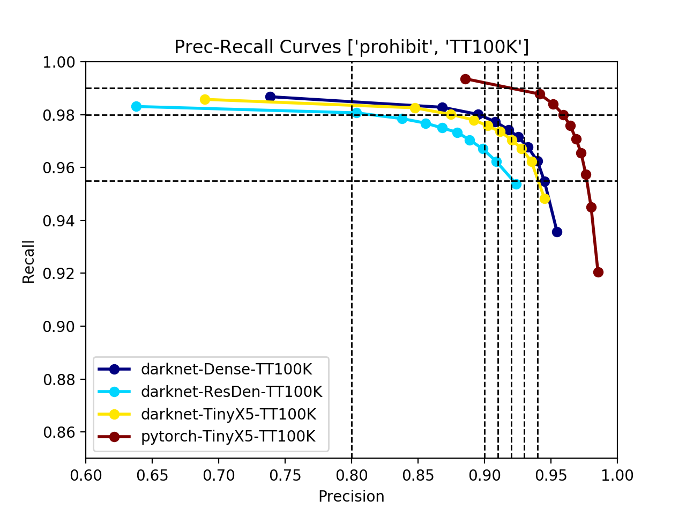

	   Editor  :   Haonan Feng
	   Date    :   2019.05.20


# Easy to Use: Object Detection Evaluation Script 

This module provides:
- report of object detection result: Generate report based on different variables, such as confidence, iou threshold, classes, or object scale

- provide `mAP`, `Precision`, `Recall` reuslt on confidence set [ 0.0, 0.1, 0.2, 0.3, 0.4, 0.5, 0.6, 0.7, 0.8, 0.9 ]

- generate `.line` file for Precision-Recall Curve drawing


## Requirement:

- numpy==1.14.0
- matplotlib==2.0.2

I have not tested any other version, but it should be OK. Tell me in the issue if any problems.


## How to use:

### Generate Detection Evaluation Report

1. change your dataser to `VOC` strucutre, or modify `parse_gtbox.py` to read annotations

2. run ```python parse_gtbox.py``` and save results to a txt file. Each line in this txt file is a ground-truth box record, the format is:
	> '{}\t{}\t{}\t{}\t{}\n'.format(imagename, 'Out:', class, confidence, boxes)

3. Let the Object Detection model output another txt file with format:
	> '{}\t{}\t{}\t{}\t{}\n'.format(imagename, 'labels:', class, confidence, boxes)
   As above, each line in this txt file is a detection box result.

4. modify parameters and run ```sh run-map_eval.sh``` to get detection result evaluation report.


### Draw Precision-Recall Curve

1. run first 3 steps in `Generate Detection Evaluation Report` session

2. modify parameters and run ```sh run-Linear.sh``` to get `.line` file and save in the `output_dir`

3. run ```python DrawLine.py -p [output_dir]``` and draw all `.line` files in the `output_dir`. 
   If you juse want to draw some files with specific keywords, use ```python DrawLine.py -p [output_dir] -k word1 word2 ```, the number of keywords is no limited.




## Example:

The `./example` document has provides a ground-truth file from `TT100K` dataset, and also with a detection result file generated by a yolov3-tiny model. To check this code, you can just simply:

1. check your environment and just make sure you have `matplotlib` and `numpy`

2. run ```sh run-map_eval.sh```

3. run ```sh run-Linear.sh```

4. run ```python DrawLine.py -p example/LINEAR```

All Done and enjoy!


## Appendix

### Parameters of `run-map_eval.sh`
```
--mode            	"standard" or "caliber". "standard" get result by different class, "caliber" sum up all classes as `dectboxes`
--buffer          	if run in first time, give a pkl filepath and it will generate automatically. If pkl exists, the code will load annotation and detection faster
--annotation_file 	annotation filepath. If buffer file .pkl exists, this will not be used
--detection_file  	detection filepath. If buffer file .pkl exists, this will not be used
--dict_file       	classes name txtfile 
--confidence      	default 0.5, but can change from 0 to 1
--iou             	default 0.5, but can change from 0 to 1
--missbox         	True or False. If True, output a "MISSBOX.txt" file which contain image name that miss the ground-truth box.
--scaletest       	True or Fasle. If True, output scale test with six objects scales <16, 16-32, 32-48, 48-64, 64-96, >96
```

### Parameters of `run-Linear.sh`
```
--mode            	same as the above
--buffer          	same as the above
--annotation_file 	same as the above
--detection_file  	same as the above
--dict_file       	same as the above
--iou             	same as the above
--output_dir      	The directory that save the '.line' file
--output_name     	The linear file will name as 'LINEAR_[output-name]_[class-name].lines'
```

